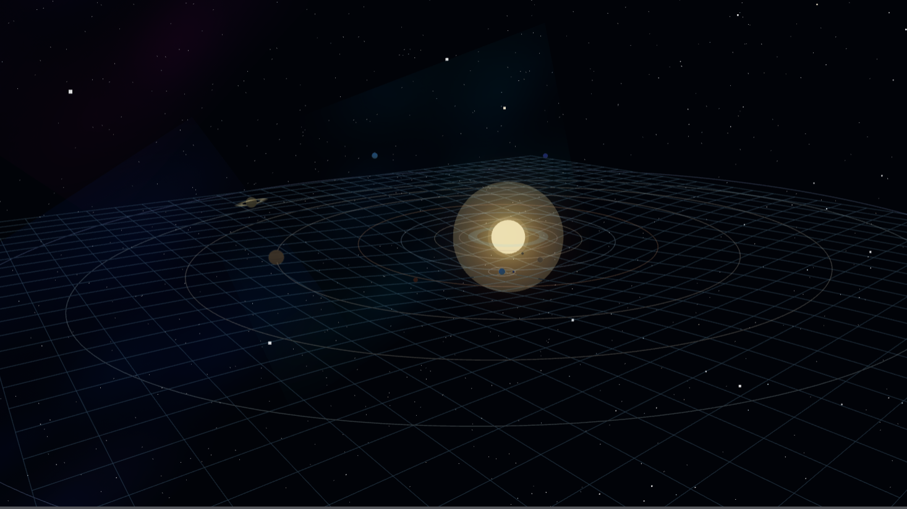

 
  
 # **3D Solar System Simulator**

## Tech Stack 

---

## Overview

A stunning, high-performance **3D Solar System Simulator**. This project combines beautiful 3D graphics with realistic physics simulation. Features include interactive orbit controls, accurate gravity simulation via WebAssembly, gesture-based hand controls, and procedurally generated stars for an authentic stellar backdrop.

The simulator accurately renders all planets with procedurally generated textures, moons, and orbital mechanics. Physics calculations run on a Rust-based WebAssembly engine for blazing-fast performance without sacrificing visual fidelity.

---

 

###  [ Visit Live Application*](https://3-d-solar-system-simulator.vercel.app/) 

---

## Key Features

### Interactive Controls
- **Orbit Controls**: Smooth camera navigation around the solar system
- **Gesture Recognition**: Hand gesture-based controls using MediaPipe
- **Keyboard & Mouse**: Intuitive interaction with responsive feedback

### Visual Excellence
- **3D Rendering**: High-fidelity graphics with Three.js
- **Procedural Textures**: Realistic planet surfaces (rocky bodies, gas giants, Earth textures)
- **Dynamic Lighting**: Multi-light system with ambient, hemisphere, and point lights
- **Star Field**: 3,600 procedurally generated stars with proper depth
- **Orbital Trails**: Visual paths showing planetary trajectories

### Performance
- **WebAssembly Physics**: Rust-based gravity simulation for 360 FPS consistency
- **Optimized Rendering**: Efficient WebGL implementation
- **Responsive Design**: Adaptive quality settings for various devices
- **Fixed-step Integration**: Accurate temporal simulation with 1/360 second timesteps

### Accurate Physics
- **N-Body Gravity Simulation**: Realistic gravitational interactions
- **Normalized Orbital Mechanics**: Accurate planetary motion
- **Softening Algorithm**: Prevents singularities and improves stability

### Responsive & Accessible
- **Mobile-Friendly**: Works on all modern devices
- **Dark Theme**: Eye-friendly interface optimized for space content
- **High DPI Support**: Pixel ratio scaling up to 2.0
- **Cross-Browser**: Compatible with all modern browsers supporting WebGL and WebAssembly

---

## Core Technologies Explained

### **Three.js** - 3D Graphics
- Renders planets, moons, stars, and orbital traces
- Manages scene lighting, camera, and WebGL context
- Provides OrbitControls for intuitive camera navigation
- Handles procedural texture generation on canvas

### **Rust + WebAssembly** - Physics Engine
- Implements N-body gravity simulation in Rust
- Compiles to optimized WebAssembly for performance
- Exports functions callable from JavaScript
- Physics constants tuned for solar system accuracy:
  - Gravitational constant: **0.52**
  - Fixed timestep: **1/360 second**
  - Softening parameter: **0.01** (prevents singularities)
  - Max iterations per frame: **180**

### **MediaPipe** - Gesture Recognition
- Real-time hand landmark detection
- Pinch gestures for zoom control
- Palm toggles for interaction mode
- Camera access with privacy controls

### **Vite** - Build Tool
- Lightning-fast development server
- Optimized production bundling
- Native ES modules support
- WASM integration built-in

---

##  Resources & References

### Learning Resources
- [Three.js Documentation](https://threejs.org/docs)
- [Rust WASM Guide](https://rustwasm.org/)
- [N-Body Simulation](https://en.wikipedia.org/wiki/N-body_problem)
- [MediaPipe Hands](https://google.github.io/mediapipe/solutions/hands)

### APIs Used
- [Fetch API](https://developer.mozilla.org/en-US/docs/Web/API/Fetch_API)
- [WebGL](https://developer.mozilla.org/en-US/docs/Web/API/WebGL_API)
- [Web Workers](https://developer.mozilla.org/en-US/docs/Web/API/Web_Workers_API)

---
